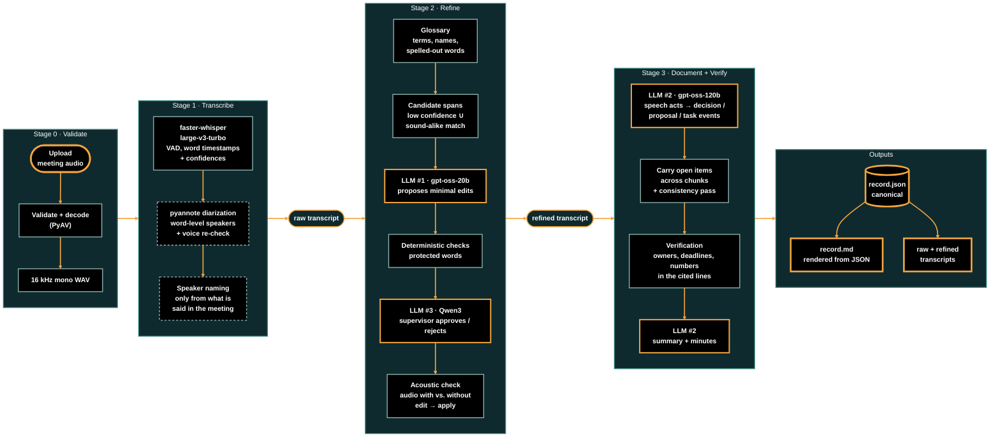

# Evidence-Traced Meeting Assistant

Turns a recorded meeting into a raw transcript, a refined transcript and a structured meeting record (summary, minutes, decisions and action items) through a multi-model pipeline with an interactive web interface.

**Core idea: every word in the output is traceable back to the audio.** The language models never write the record directly. They propose structured claims with citations (segment ids and verbatim quotes), and deterministic code checks each claim against the transcript and the audio before it is kept. Owners and deadlines are reported only when they were actually said; otherwise they are `unspecified`.

Demo link : https://drive.google.com/file/d/1ygwfLt2ejny0b471PVv59Mmer2A-F9Gj/view?usp=sharing<br>
Output sample link : https://drive.google.com/drive/folders/1GkqZIIZqi2Pl7qzR85NeKeMhIrDjjzdS
---
## Pipeline Architecture

---

## 1. Installation and running

### 1.1 Requirements

| What | Notes |
|---|---|
| **Python 3.11** | Tested with 3.11.9. Python 3.13/3.14 lack wheels for parts of the stack (torch, ctranslate2, pyannote). |
| **NVIDIA GPU + CUDA 12 driver** (recommended) | Tested on an RTX 3050 with 6 GB VRAM. Everything also runs on CPU(just slower) except diarization. |
| **Groq API key** (required) | Free at [console.groq.com](https://console.groq.com). Used by the three language models. |
| **Hugging Face token** (only for speaker diarization) | Create one at huggingface.co → Settings → Access Tokens, then open the model pages [pyannote/speaker-diarization-3.1](https://huggingface.co/pyannote/speaker-diarization-3.1) and [pyannote/segmentation-3.0](https://huggingface.co/pyannote/segmentation-3.0) and accept their user conditions. |
| ffmpeg | **Not needed.** Audio is decoded with PyAV, which is installed with faster-whisper. |

### 1.2 Install

Windows (PowerShell):

```powershell
py -3.11 -m venv .venv
.venv\Scripts\activate
python -m pip install --upgrade pip

# 1) PyTorch with CUDA 12.x - install this FIRST
pip install torch torchaudio --index-url https://download.pytorch.org/whl/cu126

# 2) Core packages
pip install -r requirements.txt

# 3) Optional packages: speaker diarization (pyannote), NLI flags, TTS test audio, AMI evaluation
pip install -r requirements-optional.txt

# 4) Check the GPU is visible (should print: 12.6 True)
python -c "import torch; print(torch.version.cuda, torch.cuda.is_available())"
```

Linux / macOS: replace the first two lines with `python3.11 -m venv .venv` and `source .venv/bin/activate`.

Notes:
- Use a **CUDA 12.x** PyTorch build (`cu126` or `cu128`), not `cu13x`. faster-whisper's CTranslate2 backend loads `cublas64_12.dll` from PyTorch; a CPU-only or CUDA 13 build causes `Library cublas64_12.dll is not found`.
- No GPU: install plain `pip install torch torchaudio` and set `ASR_DEVICE=cpu` in `.env`.

### 1.3 Configure `.env`

Create a file named `.env` in the project folder (it is git-ignored, so keys never get committed):

```ini
# --- required ---
GROQ_API_KEY=your_groq_key

# --- speaker diarization (optional) ---
HF_TOKEN=your_huggingface_token
DIARIZE=true
SPEAKER_NAMING=true

# --- language models (three different models) ---
LLM1_MODEL=openai/gpt-oss-20b          # refinement: proposes transcript corrections
SUPERVISOR_MODEL=qwen/qwen3.8-27b      # supervisor: approves/rejects every correction
LLM2_MODEL=openai/gpt-oss-120b         # documentation: decisions, tasks, minutes, speaker names
SUPERVISE_EDITS=true
LLM1_REASONING_EFFORT=low
LLM2_REASONING_EFFORT=medium
# Groq free-tier tokens/minute per model - set to the limits shown in your Groq console
LLM1_TPM=8000
LLM2_TPM=8000
SUPERVISOR_TPM=6000

# --- checks ---
ACOUSTIC_CHECK=true                    # verify corrections against the audio (needs GPU for speed)
NLI_CHECK=false                        # extra "weak support" flags (needs requirements-optional.txt)
USE_LLM_CACHE=true                     # cache valid LLM replies in .cache/ (saves free-tier quota)

# --- speech recognition ---
ASR_COMPUTE_TYPE=int8_float16
# ASR_DEVICE=cpu                       # uncomment if you have no NVIDIA GPU
```

All settings, with defaults, are listed in [section 6](#6-configuration-reference).

### 1.4 Run

| Task | Command |
|---|---|
| **Web interface** | `streamlit run app.py` then open http://localhost:8501 |
| Command line (whole pipeline in one go) | `python run_cli.py path\to\meeting.wav --diarize --glossary "term1, term2" --attendees "Name1, Name2"` |

**Using the web interface**
1. Optional: in the sidebar, tick *Speaker diarization*, *Acoustic verification* and/or *NLI support flags*, and type agenda terms and attendee names.
2. Upload a recording (`.wav .mp3 .m4a .flac .ogg .opus .webm .mp4 .aac .wma`). It is checked automatically (Stage 0) and either accepted or rejected with a clear message.
3. Click **Generate raw transcript** (Stage 1), then **Generate refined transcript** (Stage 2), then **Generate meeting record** (Stage 3). Each stage shows its output when it finishes.
4. Download the transcripts and the record (JSON and Markdown) from the tabs. Every run is also saved to `outputs/<date>_<time>_<file name>/`.

**Command-line options** (`run_cli.py`): `--glossary` and `--attendees` take comma-separated text or `@file.txt`; `--diarize` turns on speaker diarization; `--no-acoustic` turns off audio verification of edits; `--nli` adds NLI flags; `--out DIR` changes the output folder.

---

## 2. How it works

```
upload ─► Stage 0  validate + decode (PyAV) ─► 16 kHz mono WAV
          Stage 1  faster-whisper large-v3-turbo (voice-activity detection, word timestamps + confidences)
                   [optional] pyannote diarization → word-level speakers → sentence-level voice re-check
                   [optional] speaker naming: names/roles only from what is said in the meeting
                        │ raw transcript
          Stage 2  glossary (your terms + attendee names + spelled-out words + LLM-proposed terms)
                   candidate spans = low ASR confidence ∪ sound-alike glossary match
                   LLM #1 proposes minimal edits → deterministic checks → LLM #3 supervisor approves/rejects
                   → acoustic check (Whisper scores the audio with vs. without each edit) → apply
                        │ refined transcript
          Stage 3  LLM #2 tags speech acts and emits decision / proposal / task events per chunk,
                   carrying open proposals and tasks across chunks; consistency pass for anything missed
                   verification: decisions, owners, deadlines and numbers must be in the cited lines
                   LLM #2 writes summary + minutes consistent with the verified lists
                        │
          record.json (canonical) ─► record.md (rendered from the JSON) + raw/refined transcripts
```

### Models

| Role | Model | Where it runs |
|---|---|---|
| Speech-to-text | faster-whisper `large-v3-turbo` | local GPU/CPU |
| Speaker diarization | `pyannote/speaker-diarization-3.1` | local GPU only |
| Voice re-check | `pyannote/wespeaker-voxceleb-resnet34-LM` (speaker embeddings) | local GPU only |
| LLM #1 – refinement | `openai/gpt-oss-20b` | Groq API |
| LLM #3 – refinement supervisor | `qwen/qwen3.8-27b` | Groq API |
| Acoustic verifier | `openai/whisper-large-v3-turbo` (same checkpoint as the ASR) | local GPU/CPU |
| LLM #2 – documentation and speaker naming | `openai/gpt-oss-120b` | Groq API |
| NLI flags (optional) | `cross-encoder/nli-deberta-v3-small` | local CPU/GPU |

Models are loaded one at a time and freed before the next one, so the pipeline fits in 6 GB of VRAM. All model names can be changed in `.env`.

---

## 3. Files in this repository

### 3.1 Top level

| File | What it does |
|---|---|
| `app.py` | Streamlit web interface. Upload → automatic Stage 0 check (accepted or rejected with a reason) → buttons for Stage 1, 2 and 3, each showing its output: raw transcript and speaker table; refined transcript with changes, side-by-side view and refinement log; summary, minutes, decisions (with playable audio clip and lifecycle) and action items (owner, deadline, evidence). Download buttons for every output. |
| `run_cli.py` | Runs the whole pipeline from the command line (same code as the interface); used for scripted runs and evaluation. |
| `requirements.txt` | Core Python packages (speech recognition, Groq client, Streamlit, text matching, tests). |
| `requirements-optional.txt` | Optional packages: pyannote (diarization), sentencepiece/protobuf (NLI), pyttsx3 (synthetic test audio), datasets/soundfile (AMI evaluation). |
| `README.md` | This document. |
| `.gitignore` | Keeps secrets (`.env`), the virtual environment, caches and generated outputs out of the repository. |

### 3.2 `meeting_assistant/` – the pipeline package

| File | What it does |
|---|---|
| `__init__.py` | Package marker and a one-paragraph statement of the design principle. |
| `config.py` | `Settings`: every model name, threshold, chunk size and path in one place, read from `.env` with defaults. Pins the ASR model to `large-v3-turbo` and maps it to the identical Hugging Face checkpoint used by the acoustic verifier. |
| `errors.py` | `PipelineError` – an error whose message is shown to the user as is (unsupported/empty/unreadable file, missing API key, rate limit, …). |
| `schemas.py` | Pydantic data models for everything passed between stages: words, segments, transcript, candidate spans, edit verdicts, speaker identities, proposals, tasks, and the final `MeetingRecord`. Also the exact reply formats each LLM must follow; these tolerate common model quirks (objects returned as JSON strings, empty items). |
| `utils.py` | Shared helpers: text normalisation, time formatting, word-budget chunking, fuzzy quote matching (handles "…" and stutters), `find_verbatim` (copies owner/deadline text from the transcript, never from the LLM), detection of spelled-out words ("X-Y-Z"), GPU memory cleanup. |
| `audio_io.py` | **Stage 0.** Checks the file (supported format, not empty, readable, has an audio track, not too short, not silent), decodes it to 16 kHz mono, writes WAVs and cuts the audio clips the interface plays. |
| `asr.py` | **Stage 1.** faster-whisper with voice-activity detection (no text invented over silence), word timestamps and confidences; your agenda terms and attendee names are given to Whisper as hints. Re-joins numbers Whisper splits ("12 .50" → "12.50"). Falls back to CPU if the GPU model cannot load. |
| `diarization.py` | **Stage 1 (optional).** pyannote speaker diarization (one-speaker-at-a-time output), word-level speaker assignment, a sentence-level voice re-check that moves a sentence to another speaker only when its voice clearly matches them (catches short interjections pyannote misses), and splitting of segments at speaker changes. |
| `speakers.py` | **Stage 1 (optional).** Names speakers only from what the meeting says. LLM #2 reports evidence (self-introduction, being addressed and answering, a self-stated role, a role stated about a named person); "my name is …" statements are also detected directly. Every claim is checked: the words must be in the cited segment (a mis-cited segment id is re-anchored to the segment that really contains them), a self-introduction must be spoken by that speaker and actually introduce the name, a role must be a short noun phrase. A weighted vote picks each speaker's name and role; a first name and full name count as one person; a name the speaker spelled out letter by letter overrides how it was transcribed. Unnamed speakers stay `SPEAKER_xx`. |
| `llm_client.py` | Groq client used by all three LLMs: JSON-only replies validated against the schemas with repair retries, tokens-per-minute pacing, request sizes kept under the free-tier limit, automatic recovery when a reasoning model spends its whole output budget thinking, clear errors for rate limits and bad keys, and a disk cache that stores only valid replies. |
| `prompts.py` | All LLM instructions: speaker naming, glossary, edit proposal (LLM #1), supervisor (LLM #3), speech acts and decision/task events, notes and summary/minutes (LLM #2). The prompts contain only general rules – no names, numbers or phrases from any particular meeting – and define each category by its function in a conversation. |
| `glossary.py` | Builds the Stage 2 glossary from your agenda terms, attendee names, words spelled out letter by letter in the meeting (treated as verified spellings), and terms LLM #1 proposes – kept only if they appear in the transcript or their misheard form does. |
| `phonetics.py` | Sound-alike matching (Double Metaphone) of word groups against glossary terms, so a term misheard as several words is still found. |
| `candidates.py` | Finds the places worth checking: runs of low-confidence words and word groups that sound like a glossary term. These guide LLM #1 and set how much evidence an edit needs. |
| `guards.py` | Protected words: detects when an edit would change a number (spelled-out numbers included), a negation, a commitment word (will, might, should, …) or a person's name. Such edits need strong audio evidence or are rejected. |
| `acoustic.py` | Acoustic verifier: Whisper (same checkpoint as the ASR) scores how well the audio supports a segment's text with and without each edit. |
| `refine.py` | **Stage 2 orchestration.** Glossary → candidates → LLM #1 edits → checks (the original words must exist; no deletions or rewrites; no cosmetic capitalisation; "formatting" edits must keep the same spoken words; protected words) → LLM #3 supervisor (casing, grammar, meaning, fit; missing review = rejected) → acoustic check → verdict → apply. Every edit and its verdict is logged. |
| `documentation.py` | **Stage 3.** Per chunk, LLM #2 tags speech acts and emits events: announced decisions, proposals and their status (accepted / rejected / deferred / unresolved), and follow-up tasks. Open proposals and tasks are carried across chunks. Each event must quote the transcript (mis-cited segments are re-anchored); acceptance must come from an agreement/decision act and not from the proposer alone; in-meeting activities and duplicate tasks are filtered; a consistency pass asks LLM #2 again about tagged segments with no event. Also writes the summary and minutes (in chunks for long meetings). |
| `verification.py` | **Stage 4 checks.** Decisions = accepted or announced items only. An owner must be spoken in the cited lines, or be the speaker of a first-person commitment (shown by name when the speaker introduced themself); otherwise `unspecified`, with names inferred from context kept as annotations only. Deadlines are copied verbatim. Numbers in decision/task wording must occur in the cited lines. Optional NLI flags. |
| `record.py` | Builds the canonical `MeetingRecord` (JSON), renders the Markdown report from it, formats transcripts as one paragraph per speaker turn (with segment-id ranges for traceability), and saves all output files. |
| `pipeline.py` | Runs the stages: `stage0_validate`, `stage1_transcribe`, `stage2_refine`, `stage3_document` (used one by one by the interface) and `run_pipeline` (all at once, used by the CLI and evaluation). |

---

## 4. Outputs of a run

Each run writes `outputs/<date>_<time>_<file name>/`:

| File | Contents |
|---|---|
| `audio_16k.wav` | The recording converted to 16 kHz mono (used for the playable clips). |
| `raw_transcript.txt` | Speech-to-text output, one paragraph per speaker turn: `[start - end] (segment ids) Speaker: text`. |
| `refined_transcript.txt` | The same after the accepted terminology corrections. |
| `record.json` | The canonical machine-readable record: summary, minutes, decisions, action items, unconfirmed requests, proposals not adopted, speakers, both transcripts, every proposed edit with its verdict, glossary, warnings, settings and models used. |
| `record.md` | The human-readable report, generated from `record.json`, so both always contain the same decisions and tasks. Empty lists are shown as "No decisions were reached" / "No action items were assigned". |

---

## 5. Key design decisions

1. **Edits, not rewrites.** LLM #1 returns `{original, replacement, edit_type, reason, confidence}`. An `original` not found in the transcript is rejected as a hallucination; deletions and rewrite-length replacements are rejected.
2. **Several independent checks per edit.** Code checks (protected words, capitalisation, formatting claims), a different model as supervisor (veto only; no review = rejection) and the audio itself (Whisper's score with vs. without the edit; low ASR confidence and a sound-alike glossary match allow a larger drop, protected words need the audio to actually prefer the edit).
3. **Events, not prose.** LLM #2 emits decision/proposal/task events with quotes; code keeps the state, enforces the rules (acceptance from someone other than the proposer, follow-up work only, no duplicates) and builds the record.
4. **Two kinds of decisions.** Accepted proposals ("agreed") and facts presented as settled ("announced"); the agenda and process statements are not decisions.
5. **Owners and deadlines are copied from the transcript**, never from the LLM's wording. A self-commitment gets the speaker's name only if that speaker introduced themself; a name inferred from context is an annotation, never the owner. When diarization splits one sentence between two speakers, the owner stays `unspecified`.
6. **Citations are re-anchored, not trusted.** If an LLM cites the wrong segment id, the claim is moved to the segment that really contains its quote, and then checked for meaning (a mention is not an introduction).
7. **Speaker identity comes from the meeting.** Names and roles only from what is said; a spelled-out name is the strongest evidence; a first name and full name are one person.
8. **Numbers must be spoken.** Any number in an LLM-written decision or task must occur in the cited lines, otherwise the item is flagged.

---

## 6. Configuration reference

Set in `.env` (defaults in brackets).

| Variable | Meaning |
|---|---|
| `GROQ_API_KEY` | Groq API key (required). |
| `HF_TOKEN` | Hugging Face token for pyannote models. |
| `DIARIZE` [false] | Speaker diarization on/off (also a checkbox in the interface). |
| `DIARIZATION_RECHECK` [true] | Sentence-level voice re-check after diarization. |
| `NUM_SPEAKERS` [auto] | Fix the number of speakers if known. |
| `DIARIZATION_MODEL` [pyannote/speaker-diarization-3.1] | Diarization pipeline. |
| `SPEAKER_NAMING` [true] | Name diarized speakers from the conversation. |
| `SPEAKER_ID_MODEL` [LLM2_MODEL] | Model used for speaker naming. |
| `LLM1_MODEL` [openai/gpt-oss-20b] | Refinement model. |
| `SUPERVISOR_MODEL` [qwen/qwen3.8-27b] | Refinement supervisor model. |
| `SUPERVISE_EDITS` [true] | Supervisor on/off. |
| `LLM2_MODEL` [openai/gpt-oss-120b] | Documentation model. |
| `LLM1_TPM`, `LLM2_TPM`, `SUPERVISOR_TPM` [8000, 8000, 6000] | Tokens per minute allowed per model (match your Groq limits). |
| `LLM1_REASONING_EFFORT`, `LLM2_REASONING_EFFORT` [low, medium] | Reasoning effort for gpt-oss models. |
| `USE_LLM_CACHE` [true] | Cache valid LLM replies in `.cache/`. |
| `ASR_DEVICE` [auto] | `auto`, `cuda` or `cpu`. |
| `ASR_COMPUTE_TYPE` [int8_float16] | CTranslate2 precision on GPU (CPU always uses int8). |
| `ASR_BEAM_SIZE` [5] | Whisper beam size. |
| `ACOUSTIC_CHECK` [true] | Verify edits against the audio. |
| `ACOUSTIC_MODEL` [openai/whisper-large-v3-turbo] | Checkpoint for the acoustic verifier. |
| `TAU_CONF`, `TAU_GLOSSARY`, `STRONG_MARGIN` [6.0, 3.0, 0.5] | Acoustic-check thresholds (tune with `eval/tune_thresholds.py`). |
| `LOW_CONF` [0.5] | Word confidence below which a word becomes a candidate. |
| `PHONETIC_THRESHOLD` [0.8] | Sound-alike similarity needed for a glossary match. |
| `NLI_CHECK` [false], `NLI_MODEL` [cross-encoder/nli-deberta-v3-small] | Optional NLI flags. |
| `OUTPUT_DIR` [outputs], `CACHE_DIR` [.cache] | Output and cache folders. |

---

## 7. Known limitations

- Speaker labels depend on diarization quality; overlapping speech and far-field microphones reduce it. Names are only given when the meeting states them.
- A name or number Whisper mishears can only be corrected when there is evidence of the right form (spelled out, typed in the attendee/agenda boxes, or clear from the audio); spoken numbers like "twelve fifty" can be ambiguous.
- Groq free-tier limits (tokens per minute and per day) can pause or stop long runs; the cache means a re-run only pays for calls that did not finish.
